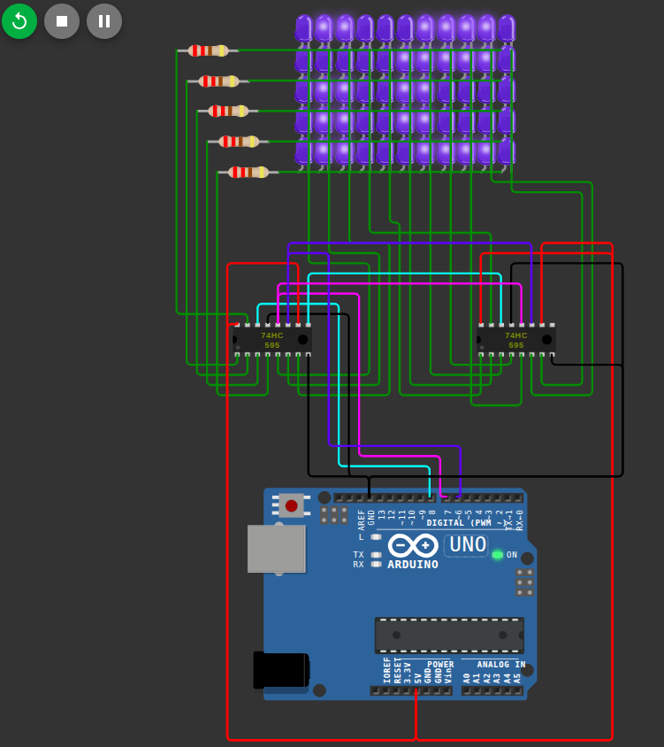

# 5x11 LED matrix controlled by 3 Arduino UNO pins via 2 8-bit shift registers

## Objective
 - Learn how 74HC595 shift registers work and use them in chain
 - Learn multiplexing in LED matrices

Modelled in WOKWI. [Link.](https://wokwi.com/projects/456871940836813825)

## Components
 - Arduino UNO
 - 55x LEDs
 - 5x 220 Ohm resistors
 - 2x 74HC595

## Additional things learned
 - Bitwise operations
 - `millis()` result should be kept in `unsigned long`, not `int`

