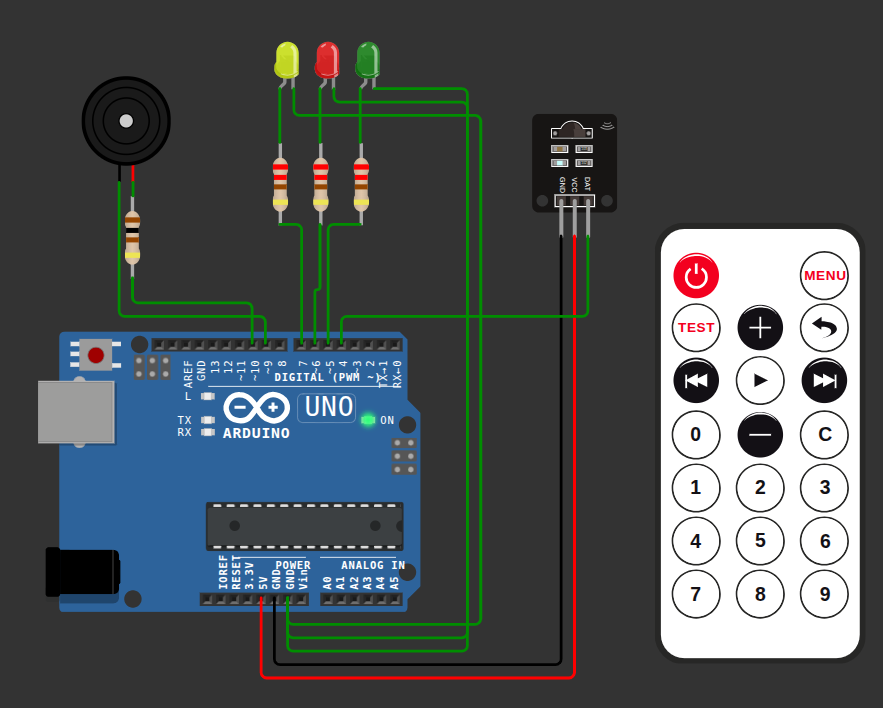
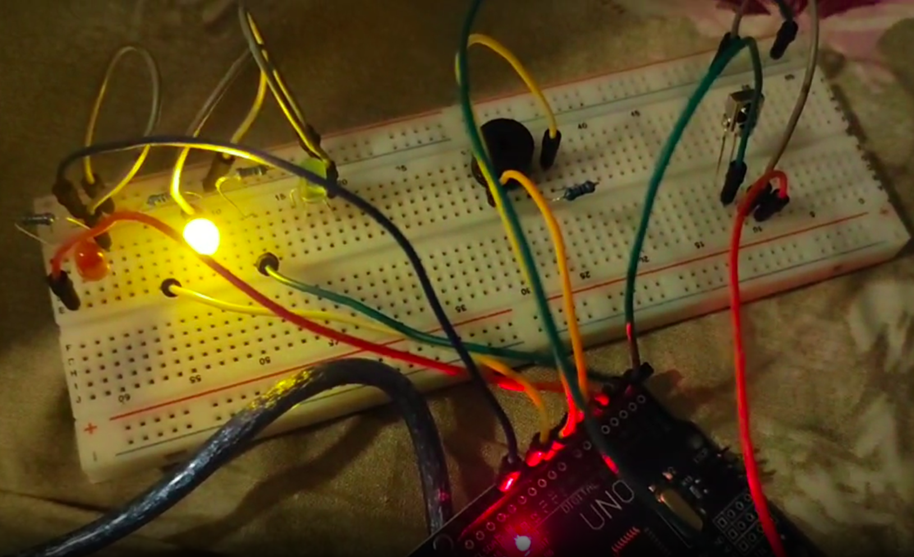
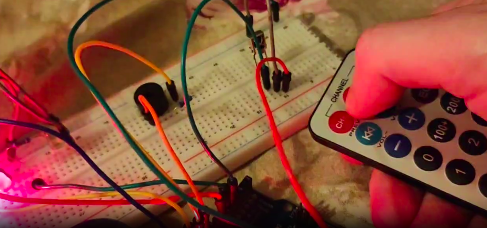

# Buzzer melodies player controlled by remote (with LEDs following in sync)

## Objective
 - Learn to manage simultaneous processes
 - Learn to use IR remote

Modelled in WOKWI. [Link.](https://wokwi.com/projects/453777359415089153)

## Components
 - Arduino UNO
 - 1x buzzer
 - 1x 100 Ohm resistor for buzzer
 - 3x LEDs
 - 3x 220 Ohm resistors for LEDs
 - 1x IR receiver
 - 1x IR remote

## Description
Main loop controls:
 - buzzer that plays notes
 - LEDs that switch together with notes
 - IR receiver that waits for signals from remote for next/prev song or a pause

## Additional things learned
 - Track time with `millis()` for non-blocking processes instead of `delay()`
 - Keep big arrays of notes in program storage using `PROGMEM` instead of dynamic memory (decreased usage from 147% to 37%)
 - Use `toneAC.h` to avoid Timer2, so that it won't block IR

## Areas for improvement
 - Save note arrays in a more memory efficient way
 - Replace songs that are not very recognizable when played by a buzzer

