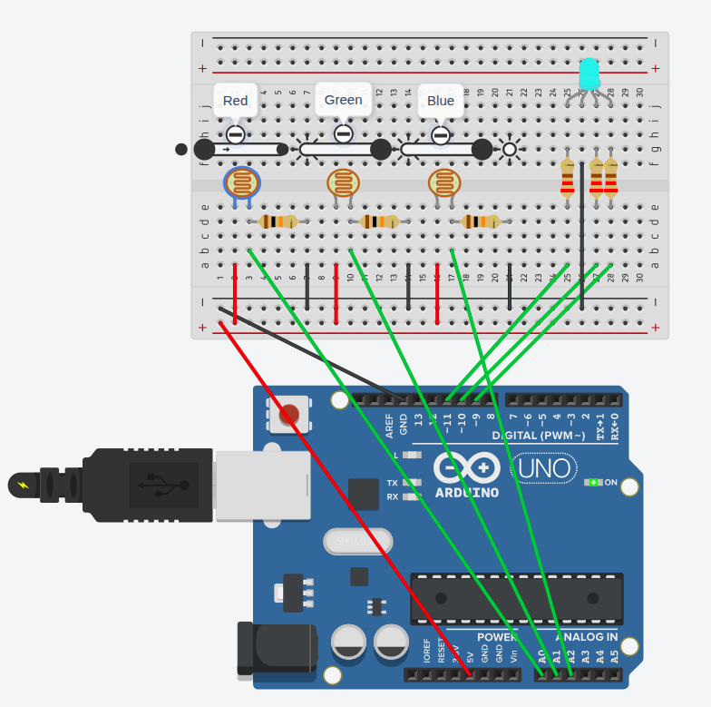

# Photoresistors + RGB LED

## Objective
 - Change RGB LED color based on how much light photoresistors get
 - Learn to use photoresistors and RGB LED

Modelled in Tinkercad. [Link.](https://www.tinkercad.com/things/kChivLVbQrf-photoresistorsrgb-led?sharecode=XIVn3l7VRXAtXokIDpI_0H_O7HNehDKOJ45DBEel4wg)

## Components
 - Arduino UNO
 - 3x photoresistors
 - 3x 10 kOhm resistors for photoresistors
 - 1x RGB LED
 - 3x 220 Ohm resistors for RGB LED

## Description
Photoresistor for red color gets more light than other two => RGB LED appears more red.
Same for other colors.

## Additional things learned
 - `analogRead` reads 0-1024, `analogWrite` outputs 0-255.

Here photoresistor for $${\color{red}red}$$ is not getting light, but ones for $${\color{green}green}$$ and $${\color{blue}blue}$$ do, which results into RGB LED being a mixture of $${\color{green}green}$$ and $${\color{blue}blue}$$ - $${\color{cyan}cyan}$$.

