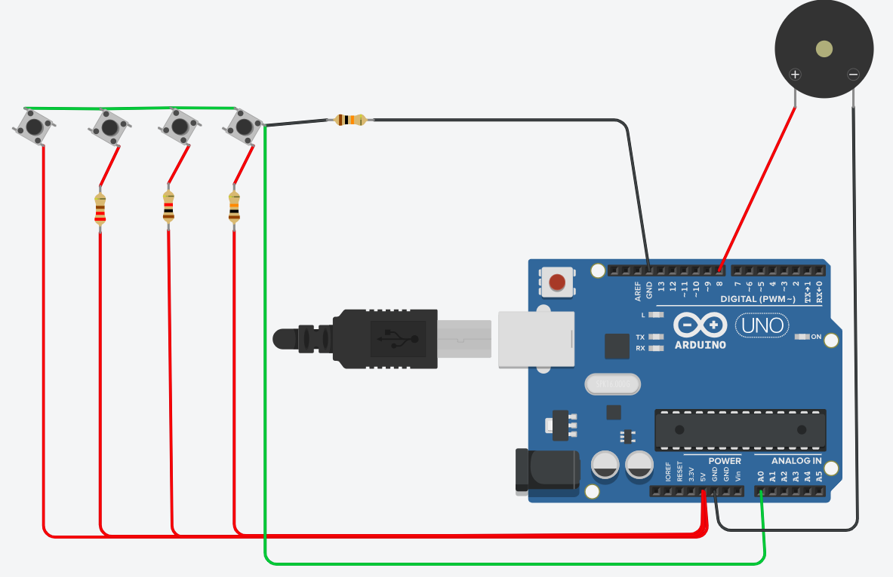
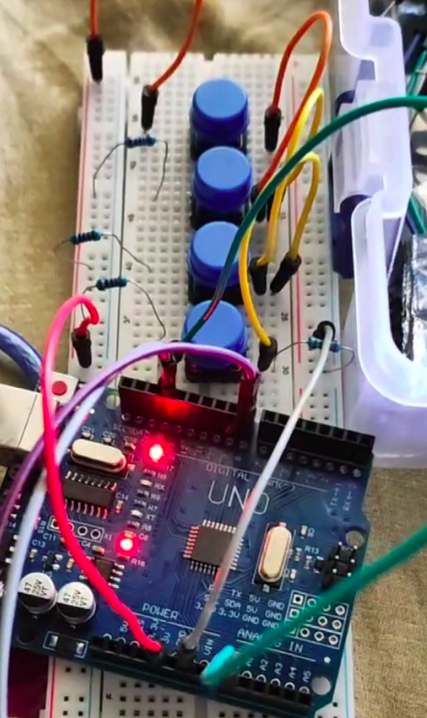

# Resistor ladder and voltage division

## Objective
 - Learn voltage divider rule
 - Read input from 4 buttons with just one analog pin

Modelled in Tinkercad. [Link.](https://www.tinkercad.com/things/5m9wguo6Y54-resistorladder?sharecode=IOJ8DtkGztSGSA_HjjfKvGUqCqBHn-nt3wQJqopH84M)

## Components
 - Arduino UNO
 - 4x push buttons
 - 1x 220 Ohm resistor
 - 1x 1 kOhm resistor
 - 2x 10 kOhm resistors (one used for pull down)
 - 1x buzzer

## Description
1 analog pin reads input from 4 different buttons and tells them apart because they bring different voltage.
Each button means a different musical note that buzzer plays for confirmation.

## Additional things learned
 - Wokwi only simulates the digital signals and will not show voltage division correctly.

