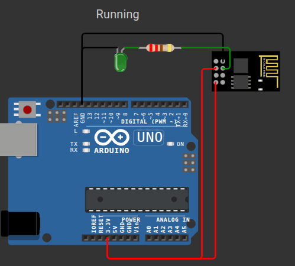

# LED control over WiFi with ESP8266 esp-01

## Objective
 - Learn to use ESP8266 esp-01
 - Control LED from a phone
 - Only use Arduino as a USB-to-Serial programmer and 3.3V power supply

## Components
 - ESP8266 esp-01
 - Arduino UNO
 - 1x 220 Ohm resistor
 - 1x LED

## Description
Code flashed to ESP via Arduino as a programmer, then ESP hosts (local IP, ex. 192.168.0.177) a web page with buttons that allow to control a LED if a device is in the same WiFi network.

Arduino used only as power supply and for programming the ESP8266 esp-01

## Programming mode:
**ESP8266 pin -> Arduino Uno pin**  
3.3V -> 3.3V  
GND -> GND  
TX -> RX  
RX -> TX  
GPIO0 -> GND (for bootloader/flashing mode)  

## Running
**ESP8266 pin -> Arduino Uno pin**  
3.3V -> 3.3V  
EN -> 3.3V  
GND -> GND  
GPIO2 -> LED -> resistor -> GND  

## Usage

## Additional things learned
 - Sometimes, if flashing resulted in error, I had to touch ESP's Reset pin to ground exactly when Arduino IDE output said "Connecting......"

## Areas for improvement
 - Find use for other 3 GPIO pins (GPIO0, RX, TX)
 - Send some data to a separate cloud API
 - Keep the device on guest WiFi, so stolen WiFi password won't give access to every other device in the network
 - Make ESP run on a battery independently from Arduino

## Useful links
 - [ESP8266 module guide](https://www.mpja.com/download/esp8266%20wifi%20module%20quick%20start%20guide%20v%201.0.4.pdf)
 - [Getting started instructable](https://www.instructables.com/Getting-Started-With-the-ESP8266-ESP-01/)
 - [Better pins description](https://www.datasheethub.com/espressif-esp8266-serial-esp-01-wifi-module/)
