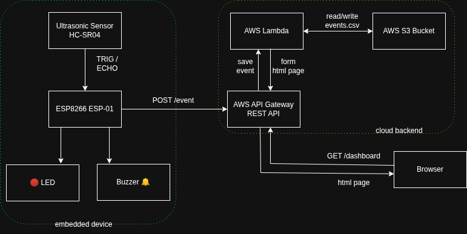
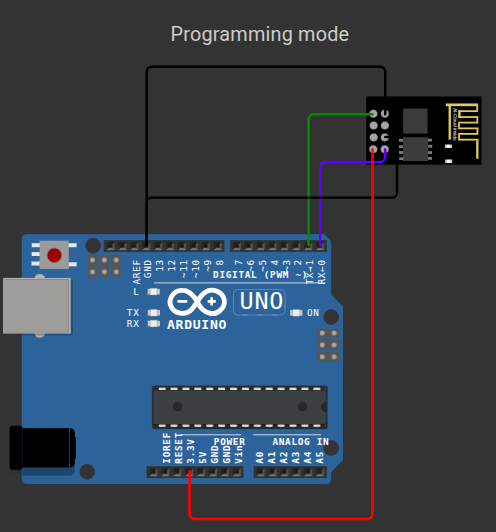
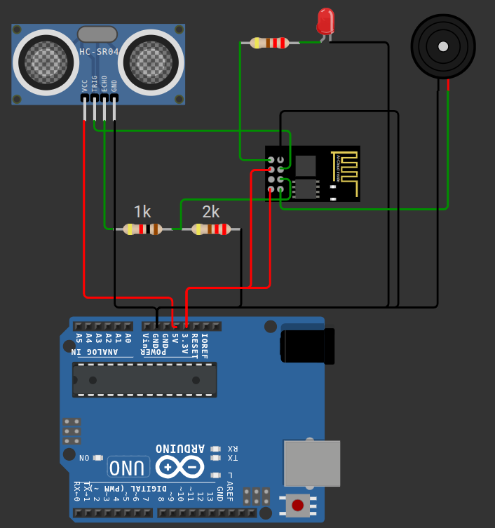
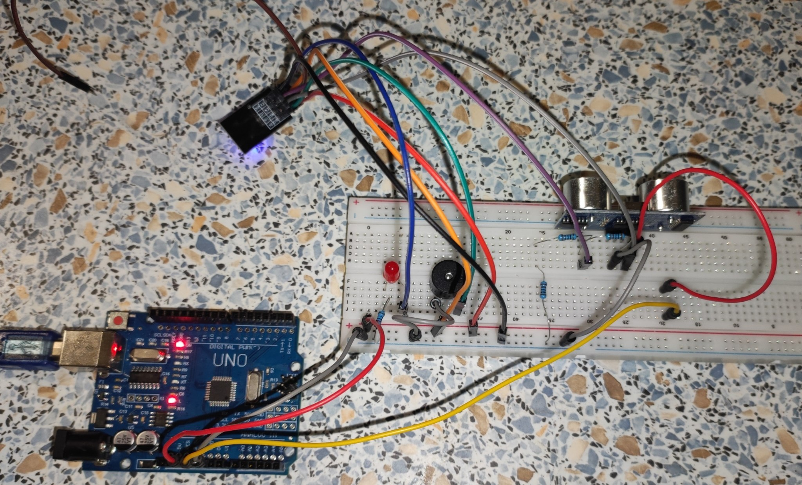
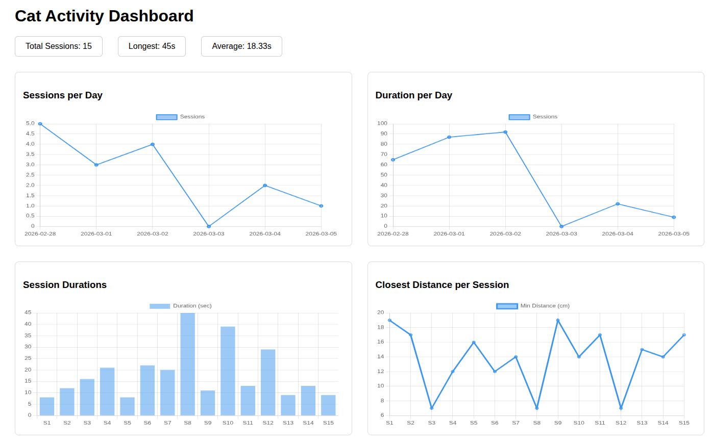

# Plant Guard with ESP8266 esp-01

## Objective
 - Protect plants from cat attacks
 - Use ultrasonic sensor to measure distance
 - Scare the nearing cat with a buzzer and a red LED
 - Keep data about that for a dashboard

Partially simulated in WOKWI - with Arduino UNO instead of esp-01 and with just printing measurements instead of sending over WiFi, due to WOKWI's limitations: [Link.](https://wokwi.com/projects/457514487009666049)

## Components
 - ESP8266 esp-01
 - 3x 1kΩ resistors for voltage division
 - 1x passive buzzer (piezo)
 - 1x ultrasonic sensor HC-SR04
 - 1x red LED
 - 1x 220Ω resistor for that LED
 - Arduino UNO (only as a USB-to-Serial programmer and power supply)

## Architecture


Code flashed to ESP via Arduino as a programmer, ESP8266 esp-01 is a main microcontroller.
Arduino used only as power supply and for programming the ESP8266 esp-01

## Description
Cat wants to destroy plants. <br/>
Ultrasonic sensor catches an incoming cat being closer than a threshold of 30cm. <br/>
It sends the measurement to esp-01. <br/>
esp-01 turns on red LED and a buzzer. <br/>
Hopefully, scared cat retreats. <br/>
esp-01 sends closest distance and duration of a threat to REST API. <br/>
Later, values are available for analysis in a dashboard, to see if cat attacks become less often (which would mean that plant guard is effective).

## Programming mode pinout
**ESP8266 pin -> Arduino Uno pin** <br/>
3.3V -> 3.3V <br/>
GND -> GND <br/>
TX -> RX <br/>
RX -> TX <br/>
GPIO0 -> GND (for bootloader/flashing mode) <br/>


## Running pinout
ESP GPIO0 <- HC-SR04 ECHO (via voltage divider to 3.3V)  <br/>
ESP GPIO2 -> HC-SR04 TRIG <br/>
ESP TX (GPIO1) -> LED -> 220Ω -> UNO GND <br/>
ESP RX (GPIO3) -> buzzer -> UNO GND <br/>

ESP 3.3V -> UNO 3.3V <br/>
ESP EN -> UNO 3.3V <br/>
ESP GND -> UNO GND <br/>
HC-SR04 VCC -> UNO 5v <br/>
HC-SR04 GND -> UNO GND <br/>

Voltage divider (1k + 1k instead of 2k because I only have 1k values):
```txt
Echo ----1kΩ----+----> ESP GPIO0
               |
              1kΩ
               |
              1kΩ
               |
              GND
```



## Demo
Cat vs plant defense system (that beeps all the time, but gif is muted)

 <br/>
Expected result: cat runs away <br/>
Actual result: cat investigates and tries to eat the device 🤷

## Dashboard


## Additional things learned
 - My cat is not afraid of buzzers making noise
 - WOKWI doesn't allow to use ESP8266 esp-01 as a main microcontroller
 - HC-SR04 needs 5V and will send 5V from ECHO pin to esp-01 which uses 3.3V. That requires voltage regulation to protect esp-01
 - When resetting from boot mode to normal working mode, keep GPIO0-GPIO3 pins unwired

## Areas for improvement
 - Make the noise more siren-like
 - Keep the device on guest WiFi, so stolen WiFi password won't give access to every other device in the network
 - Make ESP run on a battery independently from Arduino
 - Could use a PCF8574 chip (I2C expander) or 74HC165 (shift register) to have more GPIO pins for something else

## Files: 
*plant_guard.ino* - main esp-01 code <br/>
*plant_guard_debug_version.ino* - version without LED and buzzer to keep RX and TX pins for prints <br/>
*lambda.py* - AWS Lambda that processes sent events and returns html for dashboard <br/>
*template.yaml* - AWS Cloudformation template to create a stack of lambda, api, s3 bucket. Allows easy creation and deletion. 

## Creating AWS stack with sam delpoy
```commandline
sam validate
sam build
sam deploy \
  --parameter-overrides "ProjectName=<project-name-here>
      Suffix=<test>
      DeviceApiKey=<a-key-that-device-will-send-to-verify-its-identity>
      " \
  --region eu-central-1 \
  --stack-name <some-stack-name-here> \
  --resolve-s3 \
  --capabilities CAPABILITY_NAMED_IAM
```
It'll output `APIEndpoint` and `BucketName`.
> Don't put "_" into ProjectName or Suffix, they will be parts of AWS bucket name and underscores are not allowed in it.

**To delete the stack:**
First, empty the the data bucket. Then,
```commandline
sam delete --stack-name <stack-name-here> 
```

## REST API endpoints
 - Post measurement:
```commandline
curl --location '<that APIEndpoint from earlier>/event' \
--header 'Content-Type: application/json' \
--header 'DEVICE_API_KEY: <device-api-key from sam deploy>' \
--data '{
    "duration": 41,
    "min_dist": 8
}'
```
`duration` - integer, duration of cat being too close, in seconds <br/>
`min_dist` - closest, in cm, where cat had been

 - Get dashboard:
```commandline
curl --location '<that APIEndpoint from earlier>/dashboard'
```
 - Get dashboard with example data (for when nothing's been sent yet):
```commandline
curl --location '<that APIEndpoint from earlier>/dashboard?demo=true'
```
