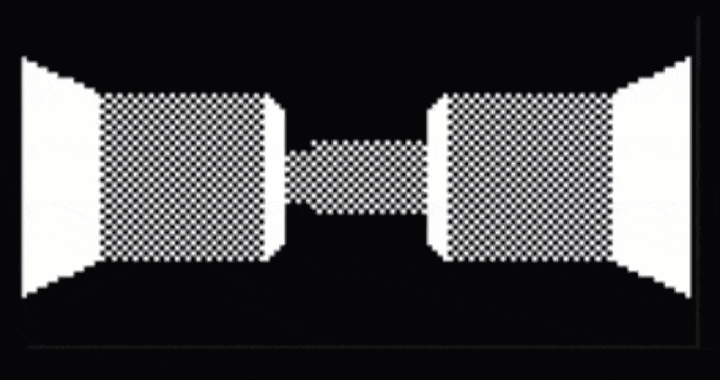
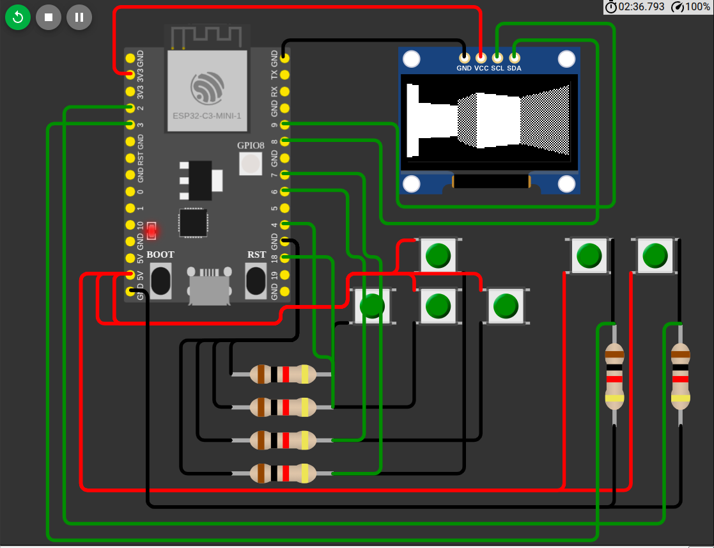

# Ray casting in C++ with esp32-c3

## Objective
 - Try ESP32-C3
 - Run in a 3D maze
 - Write ray casting in C++

Simulated in WOKWI, because I don't have such a display. [Link.](https://wokwi.com/projects/458513589512721409)

## Components
 - ESP32 C3
 - 128x64 OLED ssd1306
 - 6x push buttons
 - 6x 10 kOhm resistors (for pull down)

## Description
4 buttons to move in the maze. 2 buttons to turn left and right.  
DDA algorithm is used to find intersections of rays and maze walls.  
Ray casting algorithm calculates, for 123 rays, distances to the next closest wall.

## Additional things learned
 - Digital Differential Analyzer algorithm (DDA)

