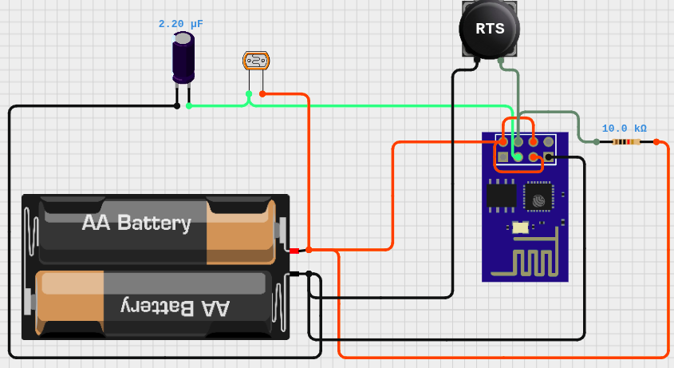
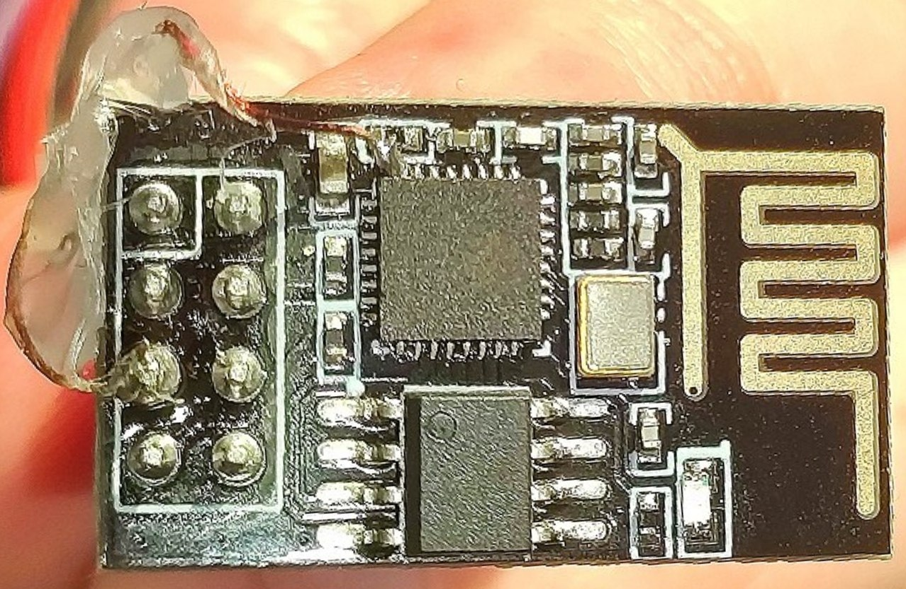
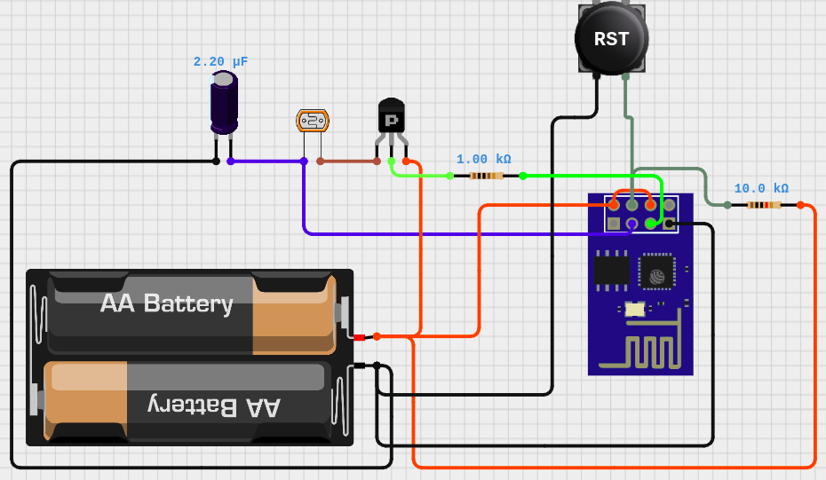
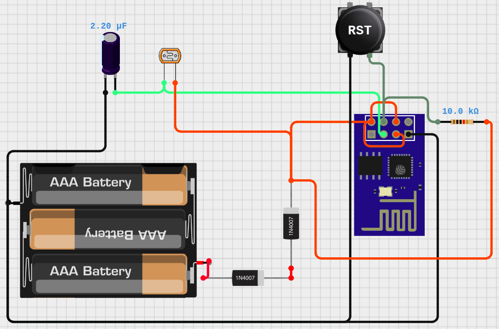
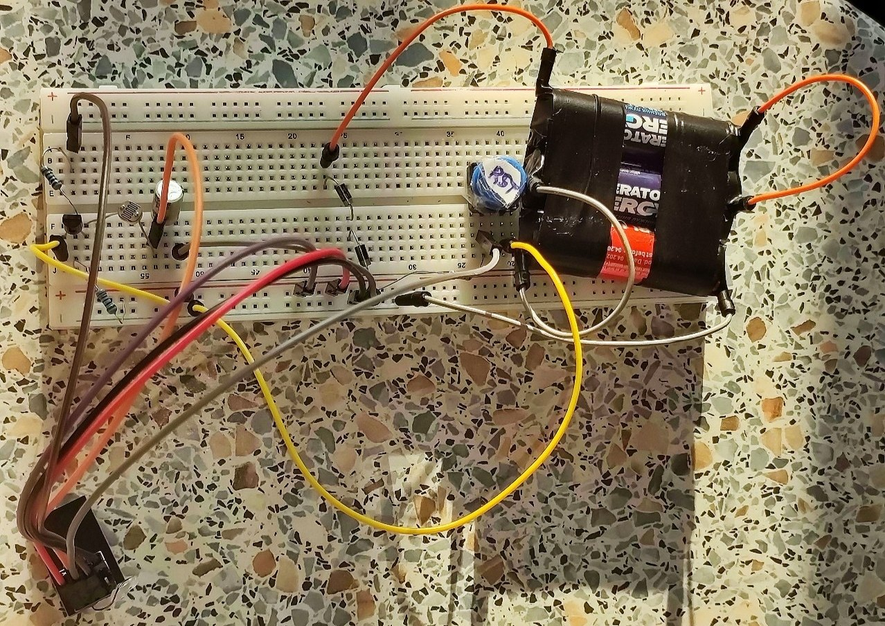
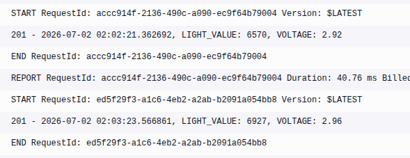

# OTA + batteries + Deep Sleep + RC Timing

## Objective
- make a prototype for a device that can gather some values and send to the API for charts
- update it Over The Air (**OTA**)
- make it **autonomous** so it works from batteries
- use **deep sleep** when not working to save batteries
- make it work like so independently for a week

## Components
 - ESP8266 esp-01
 - 1x 2.2muF capacitor for RC circuit
 - 1x photoresistor
 - 1x push button for RESET
 - 1x 10 kOhm for the button
 - 2 AA batteries
 
## Description

**Measure mode**: wake up, measure voltage, empty the capacitor, measure time it takes to fill it again through the photoresistor:
 - ≈400 for a very bright light 
 - ≈6000 for an average lit room
 - ≈14000 for dark shadows
 
Send this values of light and voltage to the API link. 

Then go into deep sleep for 5 minutes.

**OTA updates mode**: to enter this mode, click RST button twice, with a second in between. There is a value written to the Real-Time Clock (RTC) memory, that allows to catch two RST clicks, so when it happens esp starts waiting for OTA updates for 1 minute, then restarts as usual.

## Decisions
 - measure amount of light with photoresistor as a simple thing to measure
 - send also voltage to the API for later analysis
 - use esp-01 because it's small, has WiFi and I already own it
 - use Resistor-Capacitor Timing for photoresistor as the esp01 pins are digital
 - use double click on RST button because using reset reasons didn't work because pins RST and GPIO16 are connected for deep sleep purpose

## Process

### First idea
Screenshots from Cirkit Designer.

Some formula like amount_of_light ~ 1/light_value_from_device would give a good value for charts to know how much light do my plants get on my windowsill.

It also received OTA updates just fine after 2 clicks of RST button.

And went into deep sleep after sending a value. Then woke itself after several minutes as planned, because I soldered GPIO16 and RST pins together.

And it did work from batteries, although not for very long.

**BIGGEST ISSUE: LOW VOLTAGE FROM THE BATTERIES.**

### With PNP transistor
It was measured as 2.9V when powered from Arduino UNO, and, with batteries, 1.88-2.7V, with most values 2.11-2.54V, which was sometimes not enough and caused crashes.

First, I assumed there was a current leak from photoresistor that wasn't sleeping with the esp01, so I added a PNP transistor to only allow current to the photoresistor when measuring the amount of light.

Later it proved a bit pointless, as I measured that during WiFi connection the spike for both versions (with and without transistor) was ≈90mA, and in deep sleep it was 20-40muA for both.

Then I changed batteries to newer ones, twice. The issues persisted.

### Third AA battery

Then I decided to take another AA in series, getting a total voltage of 4.6V.
To lower it to acceptable values, I added 2x 1N4007 diods in series and it resulted in 3.8V. And the esp01 wouldn't start on that, probably because of how those specific diods are. So I only used just one diode, which gave 4.2V on the multimeter, and awesome 2.9V measured by the chip itself.

Here's a version with the transistor.

Worked so very nice for about 10 minutes, this were the lambda logs:

And then esp01 just burned from too much voltage 🤷

## Additional things learned

- **voltage regulators are a thing and I needed one**
- Resistor-Capacitor Timing trick allows to read analog values using digital pins
- how to measure current with multimeter when switching from 10A mode to 2000muA mode and not breaking the circuit
- how to solder GPIO16 on eps01 to the RST pin
- to use a separate guest WiFi network for IoT devices

## Conclusion

The objective of keeping it autonomous for a week was not achieved due to the chip getting burned. But all the others were achieved fine, so I see it as a success.

## Useful links
 - [Great instructable on enabling DeepSleep on ESP8266-01](https://www.instructables.com/Enable-DeepSleep-on-an-ESP8266-01/)
 - [Debugging esp01](https://arduino-esp8266.readthedocs.io/en/latest/faq/a01-upload-failed.html)
