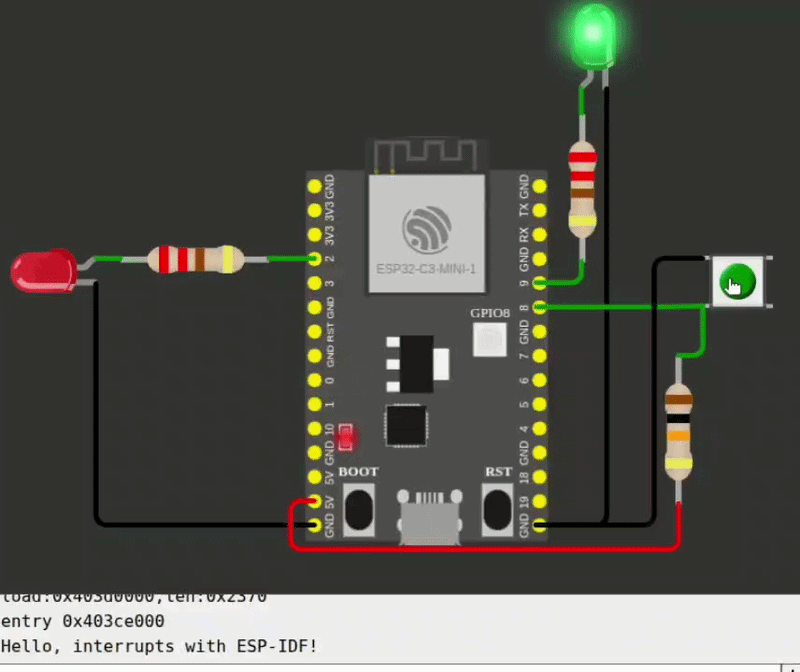

# Plant Guard with ESP8266 esp-01

## Objective
 - Use ESP-IDF for the first time
 - Get acquainted with the concept of interrupts

Simulated in WOKWI: [Link.](https://wokwi.com/projects/468915969113694209)

## Components
 - ESP32 C3
 - 2x LEDs
 - 2x 220Ω resistor for the LEDs
 - 1x push button
 - 10kΩ resistor for button pull up

## Description

Red LED switches state every second (timer interrupt).

Greeen LED switches state when button is pushed (GPIO interrupt).

## Useful links
 - 
